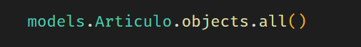

<!-- la nada -->

---

class: middle

.right-column[
# Pedro Almirall

github.com/ktowen  
twitter.com/ktowen_dev  
]
.left-column[ .avatar[
        
    ]
]

---

class: hero potter middle

# Django ORM
## y el misterio de las agregaciones multiples

---

---

class: middle center

---

class: middle center hero

# ORM

---

class: middle center

---

class: middle center

---

class: middle center

---

class: middle center

---

class: middle center

---

class: middle center

---

class: middle center

---

class: middle center

---

class: middle center

## ¿Entonces, qué pasa?

---

class: middle center

---

class: middle center

.max-height-img[]

---

class: middle center

## No es culpa de Django

---

class: middle center

## No mucho

---

class: middle center

.max-height-img[]

---

class: middle center

## ¿Cómo solucionarlo?

---

class: middle center

## Subconsultas SQL

---

class: middle center

---

class: middle center

## Dímelo en Django

---

class: middle center

## django.db.models.Subquery

---

class: middle center

## TLDR. Se complica

---

class: board

## Tarea:

- Intentar usar Subquery

---

class: middle center

## Mejor vamos a innovar

---

class: middle center

---

class: middle center

---

class: middle center

---

class: middle center

---

class: middle center

## Lo que queríamos ver

---

class: board

## Tarea:

- Comparar los resultados de usar EXPLAIN para todas las consultas

---

class: middle center

.bottom[
    [Combining multiple aggregations](https://docs.djangoproject.com/en/3.1/topics/db/aggregation/#combining-multiple-aggregations)
]

---

class: middle center

.bottom[
    [Multiple table annotation failure](https://code.djangoproject.com/ticket/10060)
]

---

class: middle

## Django ORM y el misterio de las agregaciones multiples

.right-column[
# Pedro Almirall

github.com/ktowen  
twitter.com/ktowen_dev  
]
.left-column[ .avatar[
        
    ]
]
